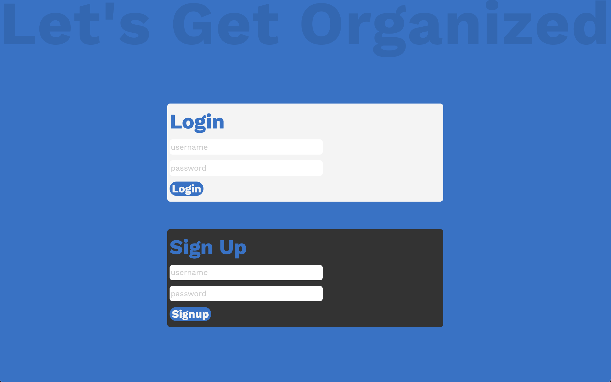
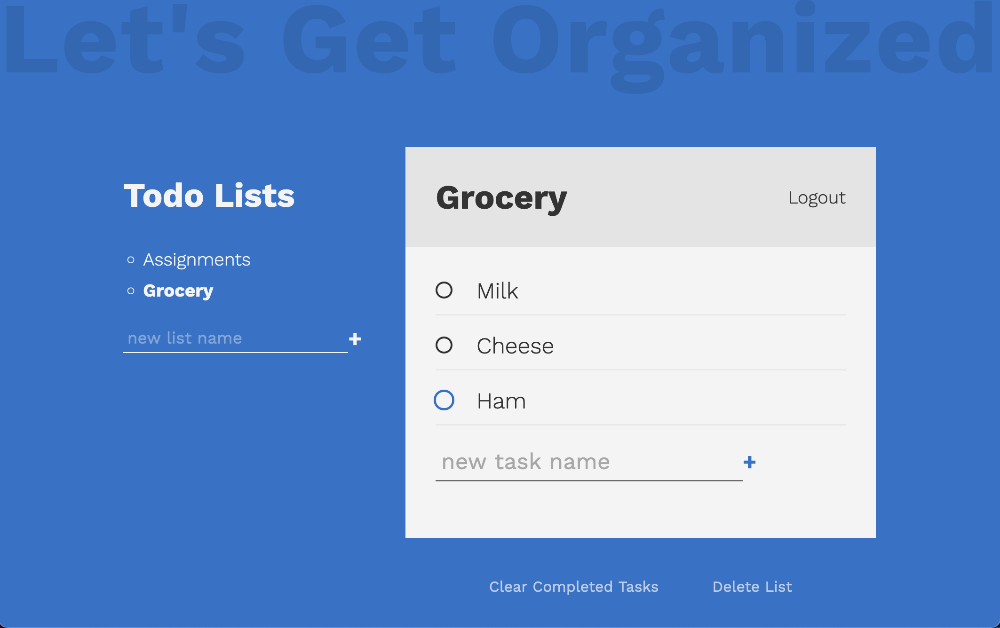

# Django Todo App
## How to use this Project

From your terminal, download the files using
```
$ git clone https://github.com/leeb2828/django_todo_app
```
<br />

A virtual environment is a tool that helps to keep dependencies required by
different projects separate from each other by using isolated virtual environments.
Create and activate your virtual environment using pipenv or venv:
<br />
First option:
```
$ pipenv install
$ pipenv shell
```
You will notice that a Pipfile and a Pipfile.lock appeared.

<br />
Second option is to create and activate your virtual environment using venv. The venv module comes 
pre installed with Python 3.5 + versions:

```
$ python3 -m venv env
$ source env/bin/activate
```

Install all dependencies from the requirements.txt file
```
$ pip install -r requirements.txt
```

<br />
<br />

Before running the server and viewing the project, you need to create the database.
```
python manage.py migrate
```
Inside of the todo_app/migrations folder, if there is no 0001_initial.py file, you will first 
need to run the python manage.py makemigrations command.

<br />

Run the server
```
$ python manage.py runserver
```
You can specify the port number with python manage.py runserver 8000.
In your browser, navigate to http://localhost:8000/ 
<br />
A signup/login page should appear:


Sign up, log in, and create some todo lists. This is what the page will look like:


<br />
<br />

I credit the front end design of this app to Kevin Powell.
Github: https://github.com/kevin-powell/todo-list-collab 
Tutorial: https://www.youtube.com/watch?v=IhmSidOJSeE
